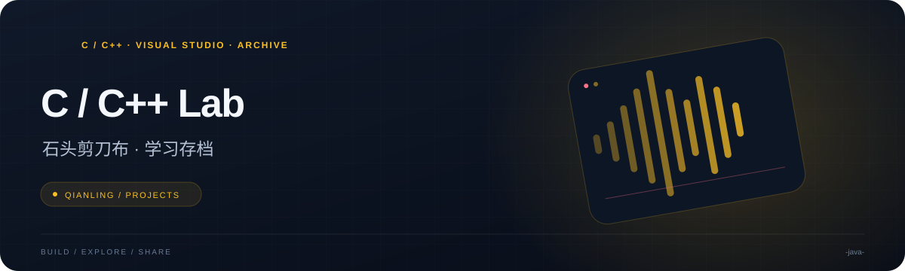

<p align="center"></p>

<h1 align="center">C / C++ Lab · 石头剪刀布 · 学习存档</h1>

<p align="center">一份早期编程练习存档：保留石头剪刀布片段、C 语言练习与随机数实验。</p>

<p align="center">  </p>

<p align="center"><a href="#当前状态">当前状态</a> &nbsp; · &nbsp; <a href="#查看与构建">查看与构建</a> &nbsp; · &nbsp; <a href="#内容索引">内容索引</a> &nbsp; · &nbsp; <a href="#后续方向">后续方向</a></p>

---

## 项目概览

| 方向 | 内容 |
| --- | --- |
| **项目定位** | 早期课程与个人练习存档 |
| **实际语言** | Visual Studio C/C++ 工程 |
| **当前入口** | 持续输出 0～6 的随机数 |

## 当前状态

仓库原描述是“一个附带技能的石头剪子布游戏”。**当前提交的源码并没有实现可运行的完整游戏**：石头剪刀布片段与多个 C 语言练习被注释，活动的 `main()` 会持续打印 0～6 的随机数字。

仓库名称包含 `java`，实际源码为 `.cpp`，工程文件为 Visual Studio `.sln` / `.vcxproj`。因此本页按 C/C++ 学习存档介绍，不将其标记为 Java 应用。

## 查看与构建

```powershell
git clone https://github.com/QIANLING-0831/-java-.git
cd .\-java-
```

在 Windows 上使用 Visual Studio 的 C++ 桌面开发工作负载，打开 [`石头剪刀布.sln`](石头剪刀布/石头剪刀布.sln)。源码引用 `graphics.h`，构建前需要配置相应的 EasyX 头文件和库。

当前入口是无限随机数输出循环，运行后可用 **Ctrl+C** 结束进程。历史可执行文件不保证与当前源码行为相同。

## 内容索引

| 路径 | 内容 |
| --- | --- |
| [源.cpp](石头剪刀布/石头剪刀布/源.cpp) | 石头剪刀布片段、数学与指针练习、文件处理片段及当前随机数入口 |
| [工程目录](石头剪刀布/石头剪刀布) | Visual Studio 工程与练习数据 |

## 后续方向

如果继续开发游戏，首先需要恢复并整理对局入口，再补齐技能规则、输入校验与胜负判定。现有代码适合作为学习材料与历史记录。

仓库尚未包含许可证文件，使用或再分发前请与作者确认授权。
